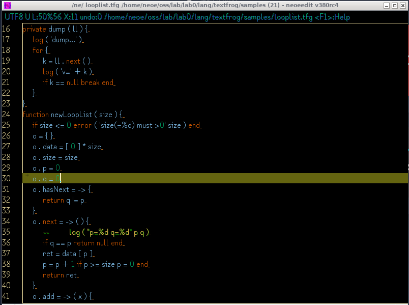

neoeedit
=====================
neoeedit - a smart, light, powerful text editor.


intro to neoeedit
=====================

- Open source, BSD LICENSE
- Written in Java
- Highly customized Java Swing GUI editor component
- Stable, performant, crash proof
- Good Unicode, CJK support, Good font handling
- Rectangular mode
- Integrated IME support
- Also an image viewer
- Also a command line console (no tty no input support)
- Script ( in Java )
- Advanced search (like grep)
- `Smart` philosophy:
  * when encounter a problem , instead of panic, it find solutions to go on
  * when you don't configure , it find best option for you
- Small executable(200KB?), no bloatware. drop features that not often used while need lots code
- No online data transmission or any telemetry, means privacy protected
- Since 2009




### Default key-bindings:(can be changed in config file, located in $homedir/.neoeedit)
<pre>

    <kbd>ctrl</kbd>-<kbd>C/V/X</kbd>: copy/paste/cut

    <kbd>ctrl-1</kbd>: go to file (and lineno) of current line.
    <kbd>alt-E</kbd>(or <kbd>F9</kbd>): execute current line as command line
    <kbd>ctrl-O</kbd>: list files in current dir, then use ctrl-1 to open one of them.
    <kbd>alt-P</kbd>: move cursor between pair marks. (works on (){}<>)
    <kbd>ctrl-L</kbd>: goto line
    <kbd>ctrl-A</kbd>: select all
    <kbd>alt-A</kbd>: select and copy current line
    <kbd>ctrl-D</kbd>: delete current line
    <kbd>ctrl-R</kbd>: remove all trailing spaces
    <kbd>alt-H</kbd>: show hex for selected string
    <kbd>alt-W</kbd>: wrap lines (at cursor position, CJK character's counted as two.)

    ctrl-S: save file
    F2 : save as

    ctrl-N: new empty document in current window
    ctrl-M: new empty document in new window
    ctrl-TAB: show all documents in window. You can jump to one of them by press ctrl-1 on it.
    ctrl-Q: quick switch between documents.
    ctrl-W: close current document, and record to open file history.
    alt-L: launch current line using system default launcher (for file, executable, text, or URL).
    ctrl-H: open file history
    ctrl-P: print (beautiful)

    ctrl-Z: undo
    ctrl-Y: redo

    ctrl-F: find/replace
    F3 : find next
    F4 : find prev

    ctrl-E: set encoding
    F5 : reload with encoding

    alt-left alt-right: quick indent
    home end, ctrl up,down,left,right: cursor control

    Keywords highlighting (java,c,python,lua,shader 500+ keywords)
    Comments auto detection, like # // -- /**/
    drag and drop files to open
    F1: help
    ctrl-F1: show banner

    Encoding auto detection . for UTF-8, UTF-16, UTF-32, SJIS, GBK. Good unicode support.

    replace/find in files, and in dir/sub-dir

    alt-\: rectangular mode
    alt-/: switch line between / and \ (for path seperator)

    ctrl-mouse scroll: zoom in/out
    ctrl-0: zoom reset

    alt-f:list fonts, then ctrl-1 on it to set font

    alt-j: script to process on the text

    alt-c: switch between preset color modes, there are 3 now: White, Black, Blue.
    
    alt-S : change line seperator between windows(\r\n) and unix(\n)
    
    alt-R : readonly mode (for novel reading)

    It's also a image viewer! View large JPG, GIF, BMP, PNG images easily.
        Left, Right: view previous/next image
        Up, Down: rotate image
        0: reset image
        Ctrl-W / H / O: functions like what it did in text editor mode
        F1: toggle thumbnail
        `[` `]`:slide show speed
        ctrl-click, ctrl-drag to select an area, then ctrl-s to save.


    Configurable font List (in config file)

    Plugins:
    how to use: copy plugin jar into [home-dir]/.neoeedit/plugins/
    
    
    ctrl-space: toggle IME (need plugin `neoeime`, support Chinese,Japanese,English etc.)
    ctrl-shift-f: format source (need plugin `neoeformatter.jar`, support Java, C or C liked, Lua, json)
    
    select text using both mouse and keyboard
    cursor keys: up down left right home end(also Ctrl-Enter) pageup pagedown
    alt-pageup, alt-pagedown, alt-mouse scroll: horizon cursor movement
    
    (more...not listed or not added)

</pre>


### How to use

Just download a single jar to start: https://github.com/neoedmund/neoeedit/raw/master/dist/neoeedit.jar


#### Linux:

```
java -Xmx2G -jar neoeedit.jar $1 &
```


#### Windows:

- add to content-menu using `neoeedit.reg`

```
Windows Registry Editor Version 5.00

[HKEY_CLASSES_ROOT\*\Shell\Open with neoeedit]

[HKEY_CLASSES_ROOT\*\Shell\Open with neoeedit\Command]
@="\"C:\\Program Files\\Java\\jdk9\\bin\\javaw.exe\" -Xmx1000M -jar \"C:\\neoe\\neoeedit.jar\" \"%1\""

[HKEY_CLASSES_ROOT\*\Shell\Copy full name\Command]
@="\"C:\\Program Files\\Java\\jdk9\\bin\\javaw.exe\" -cp \"C:\\neoe\\neoeedit.jar\"  \"neoe.ne.CopyFullName\" \"%1\""
```

- (optional) download [exe|https://github.com/neoedmund/neoeedit/raw/master/neoeedit.exe] and put same dir with neoeedit.jar

- or without `neoeedit.exe`:

```
start javaw -Xmx2G -jar neoeedit.jar %*
```
####  install plugins
copy `plugins/*.jar` into `[userhome]/.neoeedit/plugins/`


(c) 2009-2099 neoe

